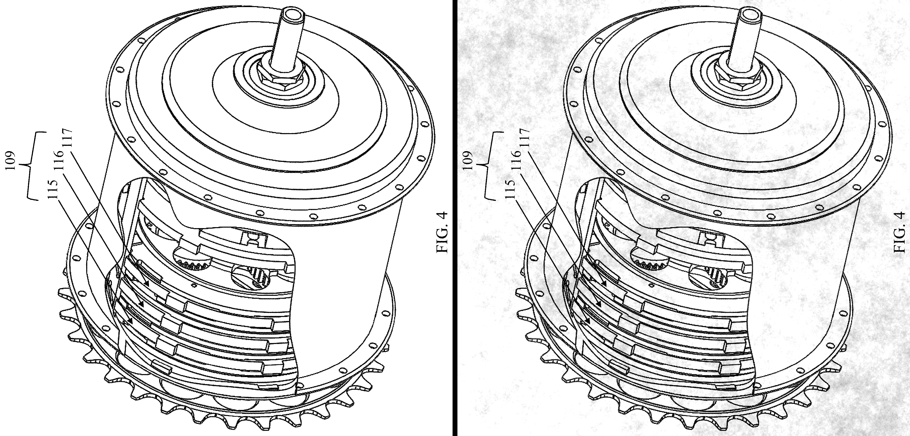

# paper-filter

A python code to add a paper-like effect to existing images

## Examples

(source of the drawing https://uspto.report/patent/grant/10,752,321#D00005)

## Dependencies

 - `OpenCV`: import and export of graphic images
